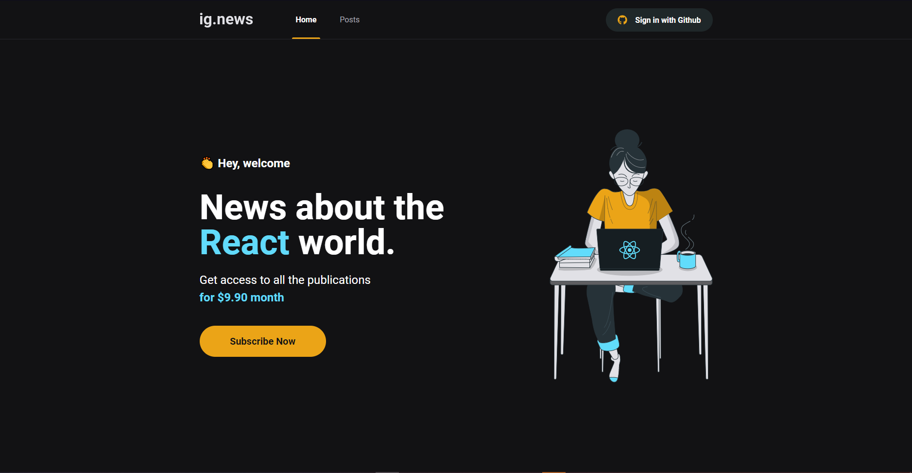

<h1 align="center"> IGNEWS </h1>

<p align="center"> App to post News, features and others about React <p>

#



#

<h3 align="center"> 
	✔  Ignews 📰 Finished  ✔
</h3>

## 🚀 Technologies
#
- [React](https://pt-br.reactjs.org)
- [Axios](https://axios-http.com/docs/intro)
- [Sass](https://sass-lang.com)
- [Typescript](https://www.typescriptlang.org/docs/)
- [FaunaDB](https://fauna.com)
- [Stripe](https://stripe.com/br)
- [Next](https://nextjs.org)
- [Prismic](https://prismic.io)

## 🔗 How To Use
#

## Enviroments Variables
#

Before execute the projetct, you need to create an file .env.local on folder and setup your keys. Bellow are all the enviroment variables you need to create:

```
# Stripe 

STRIPE_API_KEY=
STRIPE_WEBHOOK_SECRET=
STRIPE_SUCCESS_URL=http://localhost:3000/posts
STRIPE_CANCEL_URL=http://localhost:3000/
NEXT_PUBLIC_STRIPE_PUBLIC_KEY=

# Github

GITHUB_CLIENT_ID=
GITHUB_CLIENT_SECRET=

# FaunaDB

FAUNADB_KEY=

# Prismic CMS
PRISMIC_ACCESS_TOKEN=
PRISMIC_ENDPOINT=

```

## Prismic CMS
#

On Prismic, you need to create a new repository, type Post (if you want changes, you will need to change the code too) and your publication must contain the fields, UID, Title and Content. If you use more fields, you need to change in code too.

## Run Application
#


To clone and run this application, you´ll need [Git](https://git-scm.com), [Node.js](https://nodejs.org/en/) + [Yarn](https://yarnpkg.com/getting-started/install). 
It´s important to have a text editor on your computer as [VSCode](https://code.visualstudio.com/)


```bash
# Clone this repository
$ git clone <https://github.com/cainamagoncalves/ignews>

# Go to folder ignews
$ cd ignews

# Install dependencies
$ yarn add

# Run App (Web)
$ yarn dev

# The server start on port:3000 - access <http://localhost:3000>
```

## Stripe
#

After run app in dev mode, you need to install the stripe cli on your computer to monitor locale operations. [StripeCLI](https://stripe.com/docs/stripe-cli). After install and logIn your account, you need to run the command on your terminal 

```
stripe listen --forward-to localhost:3000/api/webhooks
```
### Author
---

<a href="https://cainagoncalvesportfoliov2.netlify.app">
 
 <br />
 <sub><b>Cainã Gonçalves</b></sub></a> <a href="https://cainagoncalvesportfoliov2.netlify.app" title="Portfolio">🚀</a>


Developed with ❤ by Cainã Gonçalves, contact me!

[](https://www.linkedin.com/in/cainã-gonçalves/) 
[](mailto:moaraadrean@gmail.com)


